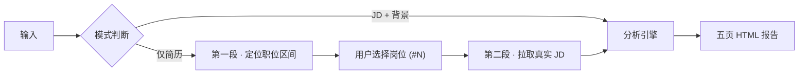
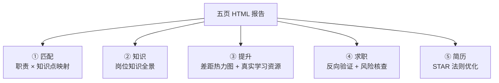
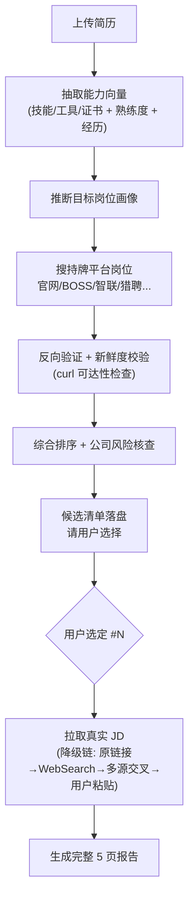

# job-fit-compass

<p align="center">
  
  
  
  
</p>

> 一个把「诊断能力差距 → 规划学习路线 → 搜靠谱岗位避坑 → 基于 JD 用 STAR 优化简历」串成闭环的求职全流程工具。名字取自 compass（指南针）：既帮你定位方向，也帮你避开坑。

---

## 简介 / Description

**中文**
job-fit-compass 是一款面向求职者的岗位匹配分析技能。输入简历后，它先定位合适的职位区间供你选择，再抓取真实 JD 做深度分析，生成交互式五页 HTML 报告：①职责×知识点匹配；②岗位知识全景；③提升建议（差距热力图＋真实学习资源）；④求职机会（反向验证真实链接、按匹配度/规模/截止时间排序、公司风险核查）；⑤STAR 法则简历优化。风险核查聚焦成立时间、社保人数、劳动仲裁及其他风险，数据缺失标注"待核"，全程不编造。

**English**
job-fit-compass is a job-fit analysis skill for job seekers. After you input your resume, it first locates a range of suitable positions for you to choose from, then fetches the real JD for in-depth analysis and produces an interactive 5-tab HTML report: ① duty×knowledge mapping; ② full knowledge landscape; ③ improvement plan (gap heatmap + real learning resources); ④ job opportunities (reverse-verified links, sorted by match/scale/deadline, company risk check); ⑤ STAR-based resume optimization. Risk checks focus on founding date, social-security headcount, labor arbitration and other risks; missing data is flagged as "待核", with no fabrication.

> 📊 Want to see it in action? Open the [sample report (GAC Changjia Automobile Service Advisor)](examples/sample-report.html).

---

## 它是怎么工作的

整体流程：无论哪种输入，最终都汇入同一套分析引擎，产出五页报告。



---

## 两种模式

| 模式 | 触发方式 | 流程 |
| --- | --- | --- |
| **JD + 背景** | 直接发岗位职责 + 你的专业/课程/技能/证书/经历 | 一步出完整 5 页报告 |
| **简历模式（交互式两段）** | 发简历 + 意向方向/城市 | 先搜出「职位区间」让你挑 → 选定后拉真实 JD → 出深度报告 + STAR 优化简历 |

> 💡 简历模式下，**第一段只给你候选清单、不生成完整报告**；你选定岗位后才会跑完整分析。这样避免「AI 替你拍板」，把方向决策权留给你。

---

## 五页报告详解

报告是一个单文件 HTML，顶部五个 Tab 切换：



| Tab | 解决什么问题 | 关键产出 |
| --- | --- | --- |
| **匹配** | 我到底符不符合这个岗？ | 每条职责拆到可演示的知识点，四色标注已会/需补/加分/软技能 |
| **知识** | 这个岗到底要懂啥？ | 硬技能卡 + 软技能卡（每张含「现在就能练」的学生场景） |
| **提升** | 差距怎么补？ | 两遍差距分析 → 优先级热力图 → 带真实课程链接的学习计划 + 学习顺序 + 3 个月路线 |
| **求职** | 去哪投？哪些公司要避开？ | 持牌平台真实链接（反向验证）+ 综合排序 + 公司风险核查（成立/社保/仲裁/其他） |
| **简历** | 怎么写才命中 JD？ | JD 要求×简历证据对齐 → STAR 重写 → 缺口桥接 → 可一键复制的优化版简历 |

---

## 交互式两段流程（简历模式）



> **为什么这样设计**：第一段把「搜索 + 验证 + 排序 + 风险」的脏活干完，只交付一份可信候选清单；你点一下编号，第二段才深入做匹配与简历优化。候选清单会落盘为 `{简历名}_候选岗位.md`，会话中途断了也能续跑。

---

## 报告长什么样（节选示意）

**Tab 匹配** 的映射表（颜色即信息，不配图例）：

| 职责模块 | 所需知识点 | 掌握度 |
| --- | --- | --- |
| 客户接待 | `来店接待七步法`（话术） | 🟢 已会 |
| 工单处理 | `DMS 工单录入`（系统模块） | 🟢 已会 |
| 异议处理 | `异议处理话术` | 🟡 需补 |
| 数据复盘 | `周报数据透视`（Excel） | 🔵 加分项 |

**Tab 求职** 的岗位清单行（每行含来源徽章 + 真实链接 + 匹配度条 + 风险 pill）：

```
#1  广汽传祺长佳 · 汽车服务顾问   [官网]  匹配 82%  规模 1万+  [低风险·可投递]
#2  某新能源公司   · 用户运营     [BOSS]  匹配 64%  规模 <100  [提示不推荐·参保仅4人]
```

---

## 快速开始

**模式一 · 直接给 JD + 背景**
> 这是「数据分析增长岗」的 JD：…… 我是 XX 大学统计学专业，学过 Python/pandas、SQL，做过数学建模……

**模式二 · 给简历找岗（两段式）**
> 这是我的简历（附 .docx）。我想在广州找服务/用户方向，你先帮我定位合适的职位区间。

→ 第一阶段会返回候选清单，你回复「选 #3」即可进入第二阶段出完整报告。

---

## 安装

把本目录复制到：

- 用户级（推荐）：`~/.workbuddy/skills/job-fit-compass/`
- 或项目级：`<项目>/.workbuddy/skills/job-fit-compass/`

目录结构：

```
job-fit-compass/
├── SKILL.md            # 技能定义与分析流程
├── README.md           # 本文档
└── assets/
    └── template.html    # 五页报告模板（含 SECTION 标记）
```

## 依赖

- 解析 `.docx` 简历需 `pip install python-docx`
- 搜岗位 / 风险核查 / 查学习资源需联网（WebSearch）

## 设计原则

- **不编造**：学习资源、JD 文本、薪资、公司风险均来自真实检索；查不到标「待核」，绝不虚构数字或 URL。
- **反向验证**：求职清单只放官网 / BOSS / 智联等持牌平台的真实链接，域名须与来源徽章一致，失效链接进「已筛除」。
- **风险中性提示**：成立时间 / 社保人数 / 劳动仲裁 / 其他风险四项核查，定级为「可投递 / 需关注 / 提示不推荐」，不做判决式表述。
- **STAR 真实**：简历优化中 R（结果）缺量化必须标「⚠ 待补量化」，缺口项不伪造成经历。

## 免责声明

风险数据来自公开渠道（企查查 / 天眼查 / 裁判文书网等），可能滞后或不全，仅作辅助判断；简历优化模块不伪造经历或量化数据。投递前请自行核实。

## License

MIT — 自由使用、修改、再分发。
